# Review 1 — System Flowcharts & Architecture Diagrams

**Due: 2026-08-19 (tentative)** · supports `Review_1_Content.md` §2 (Methodology,
Technical Design & Feasibility) and §3 (Implementation, Progress & Technical Quality)

Every diagram below is redrawn from what's already decided in
`documents/project/project_charter.md` and `documents/project/Automation_Architecture.md`
— nothing here is new design. All diagrams are Mermaid, which GitHub renders natively in
this file; nothing is a generated image. **Each diagram carries its own title bar**, so
you can screenshot just the rendered diagram block and drop it straight into a slide
without also capturing the surrounding text. Where a component is actually built vs.
still planned, it's marked explicitly:

- 🟢 **Built & tested** — real, working code exists (`camera_node/python/camera/`,
  `acoustic_node/python/acoustic/`)
- 🟡 **Scaffolding only** — folder/App Lab stub exists, no real logic yet
  (`pick_place_node/`)
- ⚪ **Not started / open decision** — no code, hardware not finalized (measurement node,
  conveyor controller)

Status is as of 2026-08-18 (`TODO.md` / `.CLAUDE/CLAUDE.md`).

---

## Contents

1. [System Architecture — Compute Nodes](#1-system-architecture--compute-nodes)
2. [Physical Station Layout on the Line](#2-physical-station-layout-on-the-line)
3. [Control Network — Ethernet/MQTT Topology](#3-control-network--ethernetmqtt-topology)
   - [3b. Network Wiring — IP Address Assignment](#3b-network-wiring--master-switch--every-nodes-ip-address)
4. [Network Protocol Stack](#4-network-protocol-stack)
5. [MQTT Topic Map](#5-mqtt-topic-map)
6. [End-to-End Data Flow (Local-Process-Then-Publish Principle)](#6-end-to-end-data-flow-local-process-then-publish-principle)
7. [Full Tile Process Flow](#7-full-tile-process-flow)
8. [Generic Station Handshake (Sequence)](#8-generic-station-handshake-sequence)
9. [Camera Station — Detailed Sequence](#9-camera-station--detailed-sequence)
10. [Acoustic Station — Detailed Sequence](#10-acoustic-station--detailed-sequence)
11. [Measurement Station — Detailed Sequence](#11-measurement-station--detailed-sequence)
12. [Final Grade Fusion Logic](#12-final-grade-fusion-logic)
13. [Tile Digital Record — State Lifecycle](#13-tile-digital-record--state-lifecycle)
14. [Database Entity Relationships](#14-database-entity-relationships)
15. [Failure Handling & Safety Rules](#15-failure-handling--safety-rules)
16. [Node Heartbeat / Health Monitoring](#16-node-heartbeat--health-monitoring)
17. [Phased Build Plan vs. Current Status](#17-phased-build-plan-vs-current-status)
18. [Prototype → Industrial Upgrade Path](#18-prototype--industrial-upgrade-path)

---

## 1. System Architecture — Compute Nodes

Distributed architecture: each inspection station is its own compute node that processes
its own raw sensor data locally and reports only a compact result to the master.
Source: `Automation_Architecture.md` §2, §5.

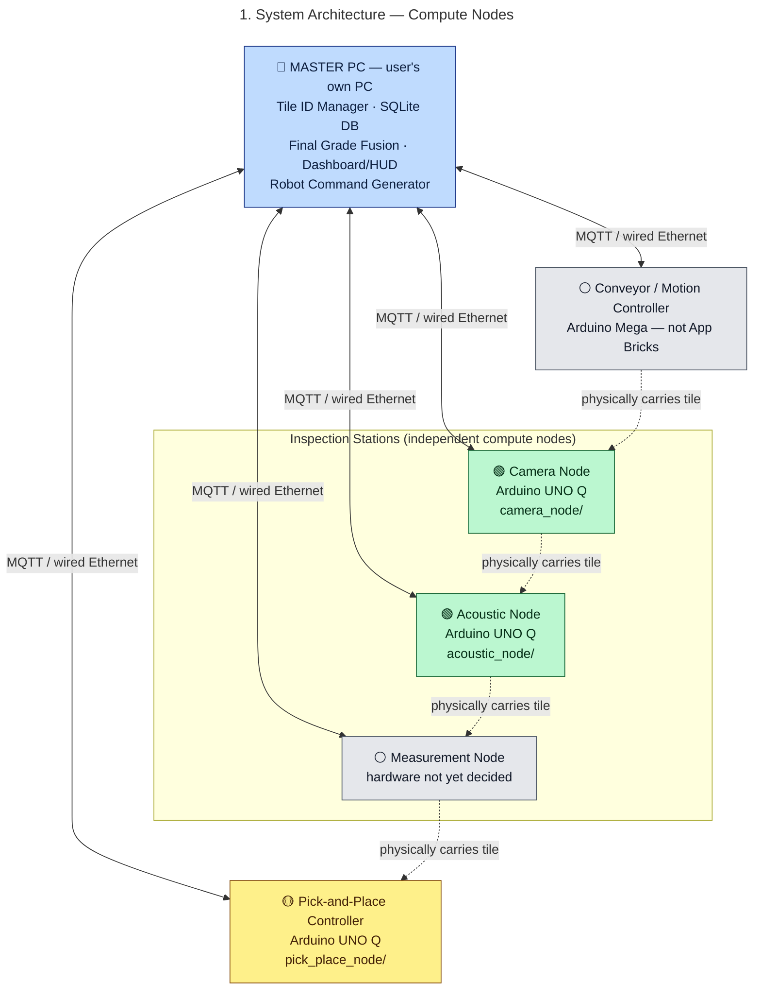

Only **one physical UNO Q board** exists today — the three-node-folder split is a
code-organization decision made ahead of hardware (`Automation_Architecture.md` §5.7),
not proof three boards are in hand.

---

## 2. Physical Station Layout on the Line

Encoder-based position tracking, not time-based (chosen because conveyor slip/speed
change/jams/e-stop all break a timer). Source: `Automation_Architecture.md` §8.

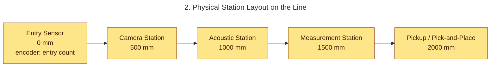

```text
tile position = current_encoder_count − entry_encoder_count
```

The controller uses this to predict exactly when a given `tile_id` reaches each station,
even with multiple tiles queued on the conveyor at once (Phase 3, §21).

---

## 3. Control Network — Ethernet/MQTT Topology

Wired Ethernet star topology, MQTT broker (Mosquitto) hosted on the master PC.
Source: `Automation_Architecture.md` §12, §23.

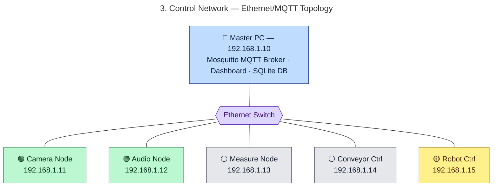

**Why wired Ethernet, not Wi-Fi:** reliability on the production floor. **Why MQTT, not
OPC UA/Modbus for the prototype:** lightweight, broker-based, trivial to prototype in
Python — §18 below maps each of these straight to an industrial equivalent later, so this
choice doesn't force a rewrite to scale up.

### 3b. Network Wiring — Master, Switch & Every Node's IP Address

Same network, drawn as a wiring/IP-assignment sheet: every device that hangs off the
switch, labeled by exactly what hardware it is and its address. Three of the five station
devices are Arduino UNO Q boards (§5.7); the other two are the Arduino Mega conveyor
controller and the still-undecided measurement node.

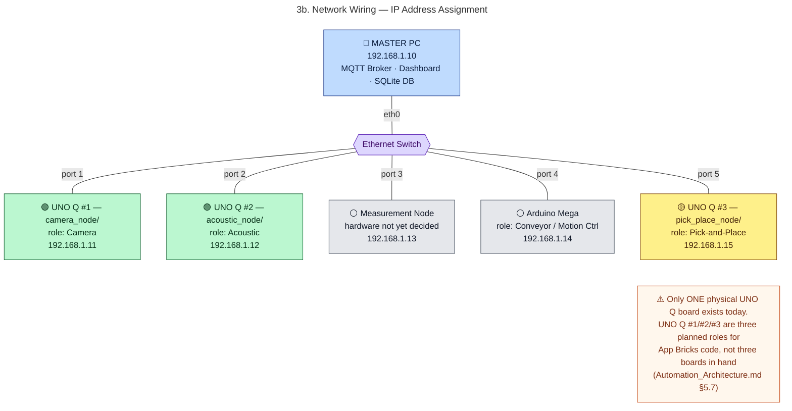

| Device | Role | IP | Hardware | Status |
|---|---|---|---|---|
| Master PC | Broker, DB, fusion, dashboard | 192.168.1.10 | User's own PC | 🔵 Confirmed |
| UNO Q #1 | Camera Node | 192.168.1.11 | Arduino UNO Q | 🟢 Built & tested |
| UNO Q #2 | Acoustic Node | 192.168.1.12 | Arduino UNO Q | 🟢 Built & tested |
| — | Measurement Node | 192.168.1.13 | Not yet decided | ⚪ Open decision |
| — | Conveyor / Motion Ctrl | 192.168.1.14 | Arduino Mega | ⚪ Not started |
| UNO Q #3 | Pick-and-Place Ctrl | 192.168.1.15 | Arduino UNO Q | 🟡 Scaffolding only |

---

## 4. Network Protocol Stack

How a station result actually gets from a node to the master, layer by layer.

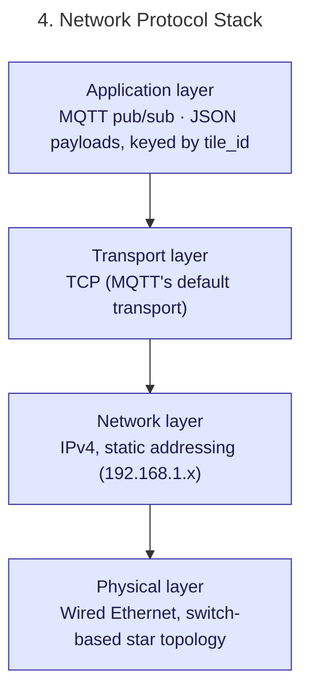

---

## 5. MQTT Topic Map

Every payload is compact JSON keyed by `tile_id` — never a raw frame, waveform, or point
cloud. Source: `Automation_Architecture.md` §4, §12–§13, §20.

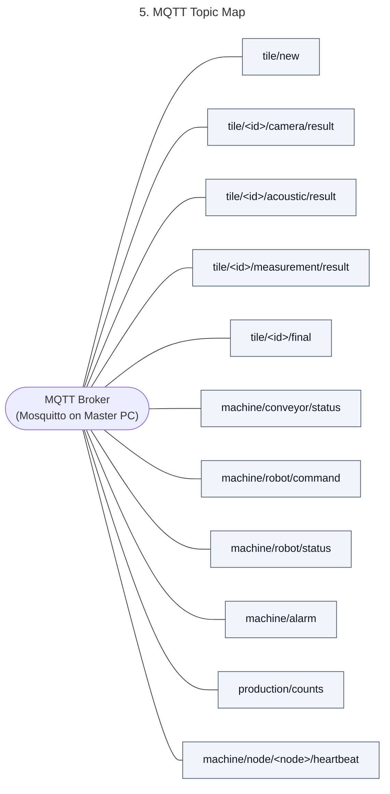

---

## 6. End-to-End Data Flow (Local-Process-Then-Publish Principle)

The core design rule (`Automation_Architecture.md` §4): raw sensor data never leaves its
station. Each node reduces its own raw data to a small structured result before it ever
touches the network.

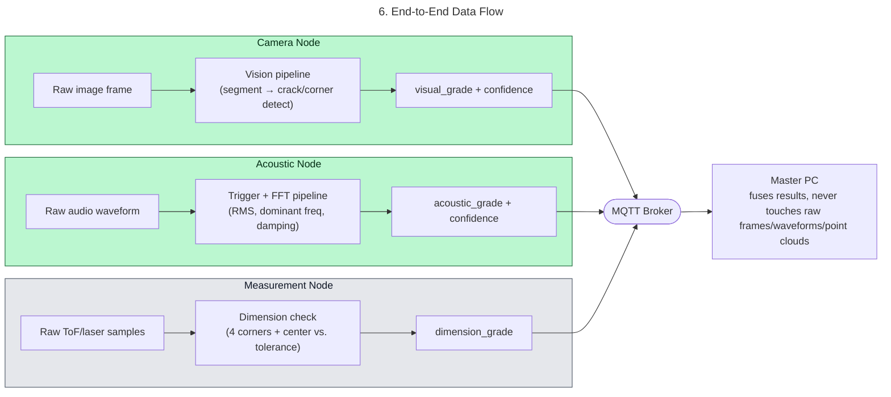

Example compact result actually sent over the wire:

```json
{ "tile_id": "T000001", "station": "camera", "grade": "A", "confidence": 0.94 }
```

---

## 7. Full Tile Process Flow

End-to-end path of one tile, from entry sensor to sorted/stacked output.
Source: `Automation_Architecture.md` §10–§11.

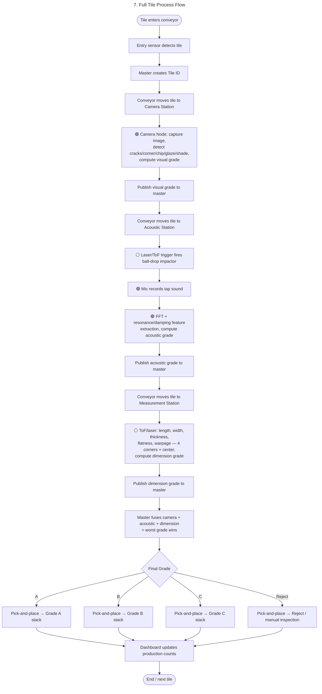

**Camera-first ordering is deliberate**: the camera node is physically first and is the
one that first announces a new tile to the master, so that tile's record starts there;
acoustic and dimensional results attach to the same `tile_id` further down the line
(`Automation_Architecture.md` §2 note, §6).

---

## 8. Generic Station Handshake (Sequence)

Every station follows the same request/acknowledge/result pattern, so the master never
has to special-case a station's timing. Source: `Automation_Architecture.md` §9.1.

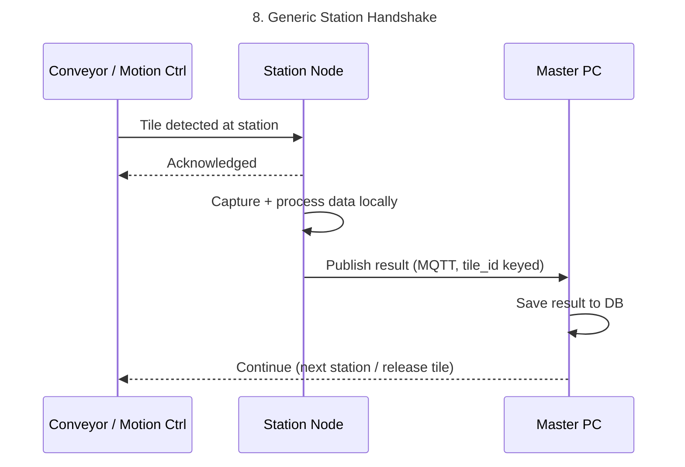

---

## 9. Camera Station — Detailed Sequence

🟢 The vision pipeline itself (`camera_node/python/camera/`) is real, tested code.
Source: `Automation_Architecture.md` §5.2, §9.2.

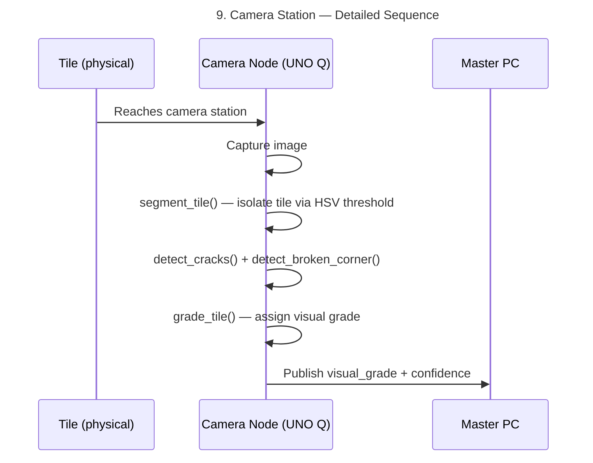

---

## 10. Acoustic Station — Detailed Sequence

🟢 Everything from "Mic records" onward (`TriggerDetector`, FFT/signal processing) is
real, unit-tested code. The laser/ToF trigger and ball-drop release hardware are still
unbuilt (`sketch/` stub only). Source: `Automation_Architecture.md` §5.3, §9.3;
`project_charter.md` §6.2.

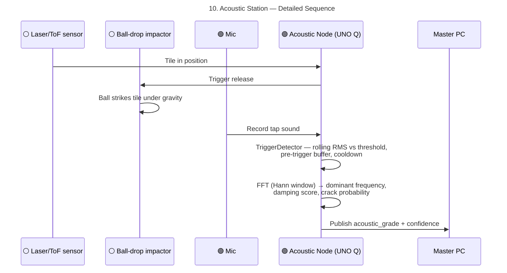

`rms_threshold` is a placeholder, not yet calibrated against a real noise floor — see
`CLAUDE.md` Known Technical Debt.

---

## 11. Measurement Station — Detailed Sequence

⚪ Not started — hardware itself is still an open decision (ToF/laser array vs. camera
contour). Source: `Automation_Architecture.md` §5.4, §9.4.

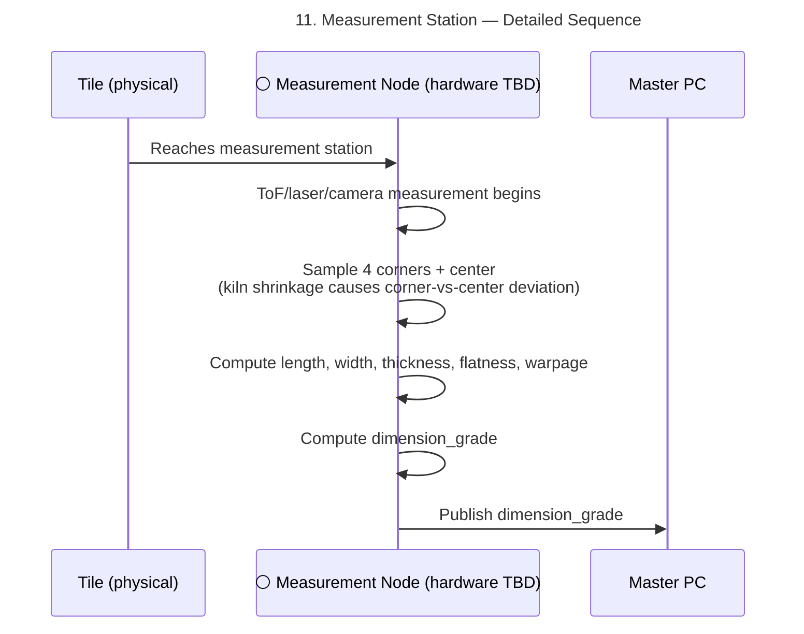

---

## 12. Final Grade Fusion Logic

Source: `Automation_Architecture.md` §14–§15.

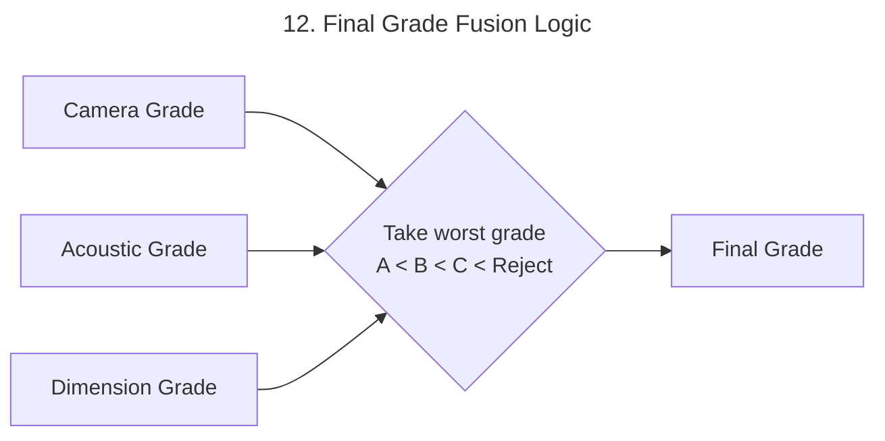

Rationale: a tile with a hidden acoustic defect must not be graded "good" just because it
passed visual inspection — worst-grade-wins is the safest rule for a first version, not
an averaged or weighted score.

---

## 13. Tile Digital Record — State Lifecycle

Every tile gets a unique ID the moment it enters the system; its record moves through
these states as each station reports in. Source: `Automation_Architecture.md` §6–§7.

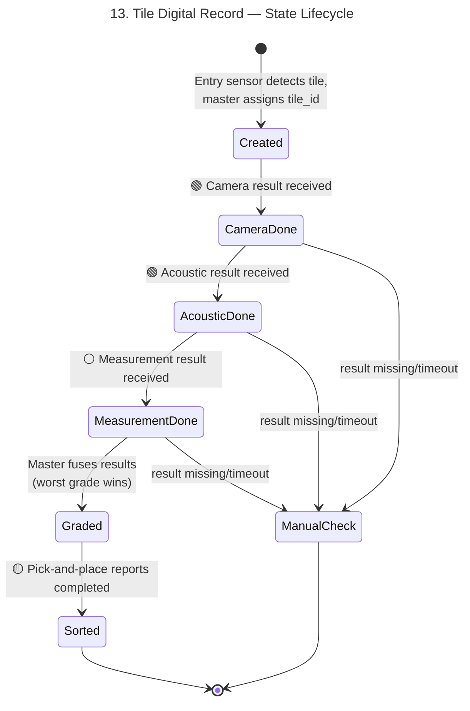

---

## 14. Database Entity Relationships

Prototype uses SQLite. Source: `Automation_Architecture.md` §17.

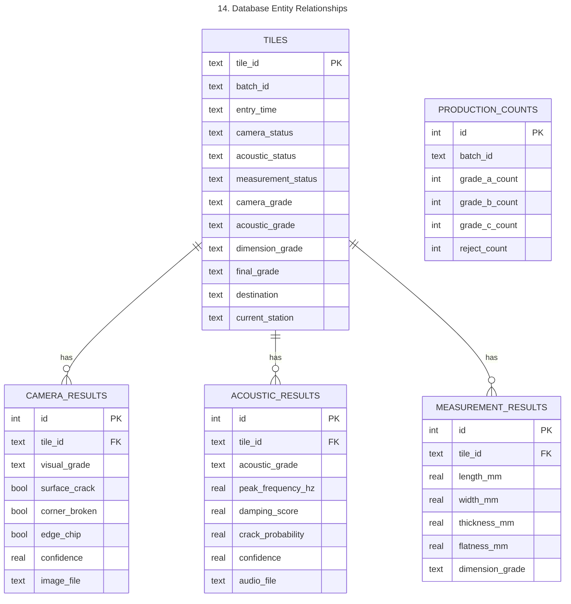

---

## 15. Failure Handling & Safety Rules

Source: `Automation_Architecture.md` §18–§19.

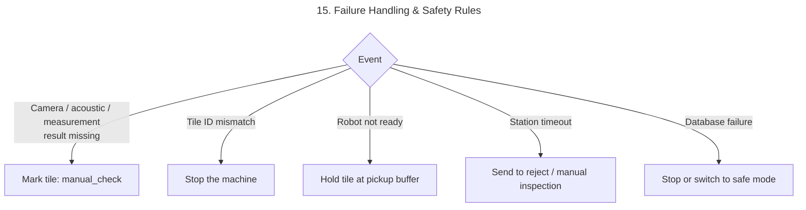

Timeouts: camera 2s, acoustic 4s, measurement 2s, robot 5s. Emergency stop and safety
interlocks are handled by the motion controller (Mega/PLC), never the master PC alone —
the master only ever issues semantic commands, never raw actuator timing (§19 rules 6,
10).

---

## 16. Node Heartbeat / Health Monitoring

Every node publishes a heartbeat; a missing one raises a dashboard alarm.
Source: `Automation_Architecture.md` §20.

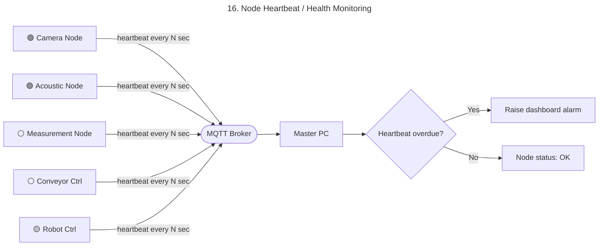

---

## 17. Phased Build Plan vs. Current Status

Source: `Automation_Architecture.md` §21, cross-checked against `TODO.md` /
`.CLAUDE/CLAUDE.md` as of 2026-08-18.

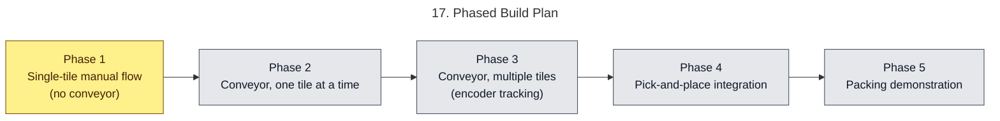

**Phase 1 detail — what's actually done vs. outstanding:**

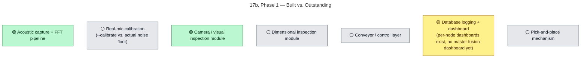

---

## 18. Prototype → Industrial Upgrade Path

Source: `Automation_Architecture.md` §24 — the same architecture is meant to scale up
without a rewrite.

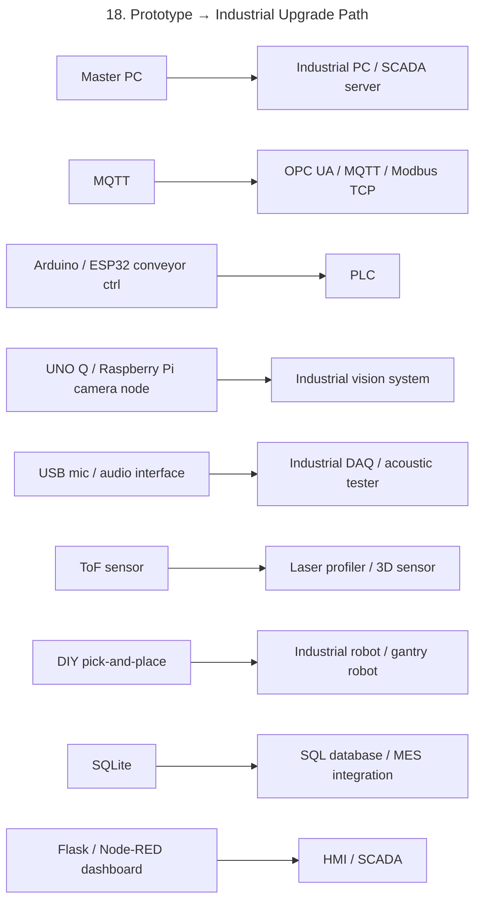

---

## Sources

- `documents/project/project_charter.md` — §3 Objectives, §6.1/§6.2 inspection method
  decisions, §7.4 control architecture decision
- `documents/project/Automation_Architecture.md` — full architecture, communication,
  database, and phased-plan source of truth (§2, §4–§25)
- `TODO.md`, `.CLAUDE/CLAUDE.md` — current build status as of 2026-08-18
