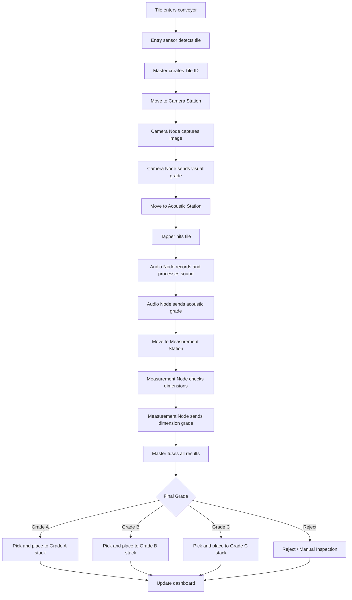

# Ceramic Tile Sorting, Handling, and Packing Automation Architecture

## 1. Project Overview

This project is an automation system for handling ceramic tiles after production. The system inspects each tile using multiple sensing methods, assigns a quality grade, and then sends the tile to the correct handling, stacking, or packing location.

The tile is classified using three main inspection methods:

1. **Camera Inspection**

   * Surface cracks
   * Corner damage
   * Edge chips
   * Glaze defects
   * Print defects
   * Color/shade defects

2. **Acoustic Inspection**

   * Hidden cracks
   * Internal weakness
   * Hollow sound
   * Abnormal resonance
   * Structural defects not visible to the camera

3. **Measurement Inspection**

   * Length
   * Width
   * Thickness
   * Flatness
   * Warpage
   * Dimensional tolerance

After inspection, a master computer combines all station results and decides the final tile grade. The tile is then handled by a Cartesian gantry performing pick-and-place under machine control (confirmed direction, see `project_charter.md` §7.4).

---

## 2. Main Architecture Idea

The system uses a distributed architecture.

Each inspection station has its own controller or compute node. These station nodes act like slaves. A master computer collects all results, maintains the tile database, calculates the final grade, and commands the pick-and-place system.

```text
┌──────────────────────────────────────────────┐
│                  MASTER PC                   │
│----------------------------------------------│
│ Tile ID Manager                              │
│ Database                                     │
│ Final Grade Logic                            │
│ Dashboard / HUD                              │
│ Robot Command Generator                      │
└──────────────────────┬───────────────────────┘
                       │
               Wired Network / MQTT
                       │
     ┌─────────────────┼─────────────────┐
     │                 │                 │
     ▼                 ▼                 ▼
┌─────────────┐   ┌─────────────┐   ┌─────────────┐
│ Camera Node │   │ Audio Node  │   │ Measure Node│
│ Raspberry Pi│   │ Pi / DAQ    │   │ Arduino/Pi  │
│ or UNO Q    │   │ or UNO Q    │   │ or UNO Q    │
└──────┬──────┘   └──────┬──────┘   └──────┬──────┘
       │                 │                 │
       └────────────┬────┴────┬────────────┘
                    │         │
                    ▼         ▼
          ┌─────────────────────────┐
          │ Conveyor / Motion Ctrl  │
          │ Arduino / ESP32 / PLC   │
          └────────────┬────────────┘
                       │
                       ▼
          ┌─────────────────────────┐
          │ Pick-and-Place Bot      │
          │ Sort / Stack / Pack     │
          └─────────────────────────┘
```

**Camera node is first in the physical station order** (Camera → Audio → Measure, per
`project_charter.md` §6.1 "Role as First Station"). It is the node that first announces
a new tile to the master (presence + visual result), so that tile's record starts there;
acoustic and dimensional results are attached to the same tile ID as the tile reaches
those nodes further down the line.

**Pick-and-Place Bot control interface:** the master issues high-level, semantic place
commands (grade/slot, not raw coordinates) to the gantry; a dedicated machine-control
layer on the gantry side translates these into axis motion, rather than the master or an
off-the-shelf CNC/G-code controller doing so directly (see `project_charter.md` §7.4,
Control architecture decision).

---

## 3. System Goals

The architecture must achieve the following:

* Track every tile individually.
* Prevent sensor data from getting mixed between tiles.
* Avoid losing data between stations.
* Process camera, acoustic, and measurement data independently.
* Send only processed results to the master.
* Maintain production counts for Grade A, Grade B, Grade C, and Reject tiles.
* Provide a dashboard or HUD for live monitoring.
* Command the pick-and-place bot only after final grade calculation.
* Support future industrial expansion into PLC, SCADA, OPC UA, and database systems.

---

## 4. Main Design Principle

Raw sensor data should be processed locally at each station.

The master should not receive large raw data unless needed for storage or debugging.

Correct data flow:

```text
Camera captures image
    ↓
Camera node processes image
    ↓
Camera node sends visual grade to master
```

```text
Mic records tap sound
    ↓
Audio node performs FFT / feature extraction
    ↓
Audio node sends acoustic grade to master
```

```text
ToF / laser measures tile
    ↓
Measurement node processes dimensions
    ↓
Measurement node sends dimension grade to master
```

The master receives compact results such as:

```json
{
  "tile_id": "T000001",
  "station": "camera",
  "grade": "A",
  "confidence": 0.94
}
```

The master does not need to receive full camera frames, raw audio waveforms, or full ToF point clouds during normal operation.

---

## 5. Compute Architecture

### 5.1 Master Computer

The master computer can be a laptop, desktop PC, Raspberry Pi 5, mini PC, or industrial PC.

For the prototype, a normal PC or laptop is recommended because it provides:

* High processing power
* Easy debugging
* Easy dashboard development
* Easy data storage
* Simple network setup
* Python development support

Responsibilities of the master:

```text
- Generate tile IDs
- Maintain tile database
- Receive station results
- Fuse camera, acoustic, and measurement results
- Decide final tile grade
- Send commands to pick-and-place bot
- Track production counts
- Display dashboard / HUD
- Store logs and inspection history
```

---

### 5.2 Camera Station Node

The camera node performs visual inspection.

Possible hardware:

* Raspberry Pi 5
* Arduino UNO Q
* Mini PC
* Jetson Nano / Jetson Orin Nano
* USB camera with master PC
* Industrial camera in future version

Responsibilities:

```text
- Capture image
- Detect cracks
- Detect corner breakage
- Detect edge damage
- Detect glaze defects
- Detect color/shade variation
- Assign visual grade
- Send result to master
```

Example output:

```json
{
  "tile_id": "T000001",
  "station": "camera",
  "status": "done",
  "visual_grade": "A",
  "surface_crack": false,
  "corner_broken": false,
  "edge_chip": false,
  "confidence": 0.95
}
```

---

### 5.3 Acoustic Station Node

The acoustic node performs hidden-defect inspection using sound.

Possible hardware:

* Raspberry Pi 5 + USB microphone
* Raspberry Pi 5 + USB audio interface
* PC + high-end DAQ
* Arduino UNO Q with external audio acquisition
* Industrial DAQ in future version

Responsibilities:

```text
- Trigger tapper or receive tap trigger
- Record sound signal
- Perform filtering
- Perform FFT
- Extract resonance features
- Detect abnormal acoustic response
- Assign acoustic grade
- Send result to master
```

Example acoustic sequence:

```text
Tile reaches acoustic station
    ↓
Tile is stopped or clamped
    ↓
Tapper hits tile with repeatable force
    ↓
Mic / piezo / DAQ records sound
    ↓
Audio node processes signal
    ↓
Acoustic grade is sent to master
```

Example output:

```json
{
  "tile_id": "T000001",
  "station": "acoustic",
  "status": "done",
  "acoustic_grade": "B",
  "peak_frequency_hz": 2810,
  "damping_score": 0.37,
  "crack_probability": 0.31,
  "confidence": 0.88
}
```

---

### 5.4 Measurement Station Node

The measurement node checks dimensions and shape.

Possible hardware:

* ESP32 + ToF sensor
* Arduino + ToF sensor
* Raspberry Pi + ToF / camera / laser sensor
* Arduino UNO Q
* Laser displacement sensor in future version
* 3D ToF camera in future version

Responsibilities:

```text
- Detect tile presence
- Measure length
- Measure width
- Measure thickness
- Measure flatness
- Measure warpage
- Check dimensional tolerance
- Assign dimension grade
- Send result to master
```

Example output:

```json
{
  "tile_id": "T000001",
  "station": "measurement",
  "status": "done",
  "length_mm": 300.12,
  "width_mm": 299.91,
  "thickness_mm": 8.04,
  "flatness_mm": 0.42,
  "dimension_grade": "A"
}
```

---

### 5.5 Conveyor / Motion Controller

The motion controller should handle the physical movement of the machine.

Possible hardware:

* Arduino Mega
* ESP32
* Arduino UNO Q
* Raspberry Pi Pico
* PLC in future version

Responsibilities:

```text
- Conveyor motor control
- Encoder reading
- Tile presence detection
- Station trigger timing
- Stopper control
- Servo diverter control
- Pneumatic actuator control
- Safety stop
- Basic machine sequence
```

The motion controller should handle real-time movement. The master PC should not directly control every motor pulse or timing-critical actuator.

---

### 5.6 Pick-and-Place Bot Controller

The pick-and-place bot receives simple commands from the master.

It should not decide the grade by itself.

Responsibilities:

```text
- Receive tile ID
- Receive pick position
- Receive destination
- Pick tile
- Place tile in correct grade stack
- Report success or failure
```

Example command:

```json
{
  "command_id": "CMD000001",
  "tile_id": "T000001",
  "action": "pick_place",
  "source": "pickup_position",
  "destination": "grade_B_stack"
}
```

Example response:

```json
{
  "command_id": "CMD000001",
  "tile_id": "T000001",
  "status": "completed"
}
```

---

## 6. Tile Identification System

Each tile must get a unique ID as soon as it enters the system.

The ID belongs to the tile, not the conveyor.

Correct concept:

```text
Physical tile → Unique tile ID → Digital record in database
```

Example:

```text
Tile enters conveyor
    ↓
Entry sensor detects tile
    ↓
Master creates tile_id = T000001
    ↓
All station data is stored under T000001
```

---

## 7. Tile Digital Record

Each tile has a digital record stored in the master database.

Example:

```json
{
  "tile_id": "T000001",
  "batch_id": "BATCH_01",
  "entry_time": "2026-07-09T14:22:41",
  "current_station": "camera",
  "camera_status": "pending",
  "acoustic_status": "pending",
  "measurement_status": "pending",
  "camera_grade": null,
  "acoustic_grade": null,
  "dimension_grade": null,
  "final_grade": null,
  "destination": null
}
```

After processing:

```json
{
  "tile_id": "T000001",
  "batch_id": "BATCH_01",
  "entry_time": "2026-07-09T14:22:41",
  "camera_status": "done",
  "acoustic_status": "done",
  "measurement_status": "done",
  "camera_grade": "A",
  "acoustic_grade": "B",
  "dimension_grade": "A",
  "final_grade": "B",
  "destination": "grade_B_stack"
}
```

---

## 8. Conveyor Tracking

The system should not depend only on time delay. Time-based tracking can fail if:

* Conveyor slips
* Conveyor speed changes
* Tile gets stuck
* Station pauses
* Emergency stop occurs
* Robot delays the system

A better method is encoder-based tracking.

Example layout:

```text
Entry Sensor       Camera        Acoustic       Measure       Pickup
    │                │              │              │             │
    ▼                ▼              ▼              ▼             ▼
  0 mm            500 mm         1000 mm        1500 mm       2000 mm
```

If the tile enters at encoder count 10000, then:

```text
Tile position = current_encoder_count - entry_encoder_count
```

Example tile queue:

```json
[
  {
    "tile_id": "T000001",
    "entry_encoder_count": 10000
  },
  {
    "tile_id": "T000002",
    "entry_encoder_count": 14500
  },
  {
    "tile_id": "T000003",
    "entry_encoder_count": 19000
  }
]
```

The controller can calculate when each tile reaches each station.

---

## 9. Station Trigger Flow

Each station should follow a handshake sequence.

### 9.1 General Station Handshake

```text
Motion controller detects tile at station
    ↓
Trigger sent to station node
    ↓
Station node replies: acknowledged
    ↓
Station node captures data
    ↓
Station node processes data
    ↓
Station node sends result to master
    ↓
Master saves result
    ↓
Machine continues
```

### 9.2 Camera Station Flow

```text
Tile reaches camera station
    ↓
Camera trigger sent
    ↓
Image captured
    ↓
Image processed
    ↓
Visual grade calculated
    ↓
Result sent to master
```

### 9.3 Acoustic Station Flow

```text
Tile reaches acoustic station
    ↓
Conveyor stops or tile is held
    ↓
Tapper is triggered
    ↓
Mic / DAQ records sound
    ↓
Audio is filtered
    ↓
FFT is calculated
    ↓
Acoustic features are extracted
    ↓
Acoustic grade is calculated
    ↓
Result sent to master
    ↓
Tile is released
```

### 9.4 Measurement Station Flow

```text
Tile reaches measurement station
    ↓
ToF / laser / camera measurement begins
    ↓
Length, width, thickness, and flatness are calculated
    ↓
Dimension grade is calculated
    ↓
Result sent to master
```

---

## 10. Full System Flow

```text
Start
  ↓
Entry sensor detects tile
  ↓
Master creates tile ID
  ↓
Conveyor moves tile to camera station
  ↓
Camera node inspects tile
  ↓
Camera result sent to master
  ↓
Conveyor moves tile to acoustic station
  ↓
Acoustic node inspects tile
  ↓
Acoustic result sent to master
  ↓
Conveyor moves tile to measurement station
  ↓
Measurement node inspects tile
  ↓
Measurement result sent to master
  ↓
Master calculates final grade
  ↓
Master sends destination to pick-and-place bot
  ↓
Pick-and-place bot sorts tile
  ↓
Dashboard updates production count
  ↓
End
```

---

## 11. Mermaid Flowchart

GitHub supports Mermaid diagrams in Markdown.



---

## 12. Communication Architecture

For the prototype, MQTT over wired Ethernet is recommended.

### Recommended prototype communication stack

```text
Protocol: MQTT
Network: Wired Ethernet
Broker: Mosquitto running on master PC
Data format: JSON
Database: SQLite
Dashboard: Node-RED / Flask / FastAPI
```

### MQTT topic structure

```text
tile/new
tile/T000001/camera/result
tile/T000001/acoustic/result
tile/T000001/measurement/result
tile/T000001/final
machine/conveyor/status
machine/robot/command
machine/robot/status
machine/alarm
production/counts
```

---

## 13. Example MQTT Messages

### 13.1 New Tile Created

Topic:

```text
tile/new
```

Payload:

```json
{
  "tile_id": "T000001",
  "batch_id": "BATCH_01",
  "entry_time": "2026-07-09T14:22:41"
}
```

### 13.2 Camera Result

Topic:

```text
tile/T000001/camera/result
```

Payload:

```json
{
  "tile_id": "T000001",
  "station": "camera",
  "status": "done",
  "visual_grade": "A",
  "surface_crack": false,
  "corner_broken": false,
  "edge_chip": false,
  "confidence": 0.95
}
```

### 13.3 Acoustic Result

Topic:

```text
tile/T000001/acoustic/result
```

Payload:

```json
{
  "tile_id": "T000001",
  "station": "acoustic",
  "status": "done",
  "acoustic_grade": "B",
  "peak_frequency_hz": 2810,
  "damping_score": 0.37,
  "crack_probability": 0.31,
  "confidence": 0.88
}
```

### 13.4 Measurement Result

Topic:

```text
tile/T000001/measurement/result
```

Payload:

```json
{
  "tile_id": "T000001",
  "station": "measurement",
  "status": "done",
  "length_mm": 300.12,
  "width_mm": 299.91,
  "thickness_mm": 8.04,
  "flatness_mm": 0.42,
  "dimension_grade": "A"
}
```

### 13.5 Final Grade Result

Topic:

```text
tile/T000001/final
```

Payload:

```json
{
  "tile_id": "T000001",
  "camera_grade": "A",
  "acoustic_grade": "B",
  "dimension_grade": "A",
  "final_grade": "B",
  "destination": "grade_B_stack"
}
```

### 13.6 Robot Command

Topic:

```text
machine/robot/command
```

Payload:

```json
{
  "command_id": "CMD000001",
  "tile_id": "T000001",
  "action": "pick_place",
  "source": "pickup_position",
  "destination": "grade_B_stack"
}
```

### 13.7 Robot Response

Topic:

```text
machine/robot/status
```

Payload:

```json
{
  "command_id": "CMD000001",
  "tile_id": "T000001",
  "status": "completed"
}
```

---

## 14. Final Grade Logic

The first version should use a simple and safe rule:

```text
Final grade = worst grade among camera, acoustic, and measurement
```

Example:

```text
Camera grade      = A
Acoustic grade    = B
Measurement grade = A

Final grade       = B
```

Example:

```text
Camera grade      = A
Acoustic grade    = Reject
Measurement grade = A

Final grade       = Reject
```

This is safe because a tile with a hidden acoustic defect should not be graded as good just because the visual inspection passed.

---

## 15. Grade Mapping

Example grading table:

| Camera Grade | Acoustic Grade | Dimension Grade | Final Grade |
| ------------ | -------------- | --------------- | ----------- |
| A            | A              | A               | A           |
| A            | B              | A               | B           |
| B            | A              | A               | B           |
| A            | A              | C               | C           |
| A            | Reject         | A               | Reject      |
| Reject       | A              | A               | Reject      |
| B            | C              | A               | C           |
| C            | B              | B               | C           |

Grade priority:

```text
A < B < C < Reject
```

The final grade is the worst grade.

---

## 16. Dashboard / HUD Requirements

The master should provide a live dashboard.

The dashboard should show:

```text
Total tiles processed
Grade A count
Grade B count
Grade C count
Reject count
Current tile ID
Current station status
Camera result
Acoustic result
Measurement result
Final grade
Destination
Conveyor status
Robot status
Alarm status
Batch number
Tiles per minute
```

Example dashboard layout:

```text
┌──────────────────────────────────────────────┐
│ TILE SORTING AND PACKING SYSTEM              │
├──────────────────────────────────────────────┤
│ Total Today: 1248        Speed: 18 tiles/min │
│ Grade A: 1030            Grade B: 162        │
│ Grade C: 43              Reject: 13          │
├──────────────────────────────────────────────┤
│ Current Tile ID: T001249                     │
│ Camera: A       Acoustic: A      Measure: B  │
│ Final Grade: B  Destination: Grade B Stack   │
├──────────────────────────────────────────────┤
│ Camera Node: OK                              │
│ Acoustic Node: OK                            │
│ Measurement Node: OK                         │
│ Conveyor: Running                            │
│ Robot: Ready                                 │
├──────────────────────────────────────────────┤
│ Latest Alarm: None                           │
└──────────────────────────────────────────────┘
```

---

## 17. Database Design

A simple SQLite database is enough for the prototype.

### 17.1 Tiles Table

```sql
CREATE TABLE tiles (
    tile_id TEXT PRIMARY KEY,
    batch_id TEXT,
    entry_time TEXT,
    camera_status TEXT,
    acoustic_status TEXT,
    measurement_status TEXT,
    camera_grade TEXT,
    acoustic_grade TEXT,
    dimension_grade TEXT,
    final_grade TEXT,
    destination TEXT,
    current_station TEXT,
    created_at TEXT,
    updated_at TEXT
);
```

### 17.2 Camera Results Table

```sql
CREATE TABLE camera_results (
    id INTEGER PRIMARY KEY AUTOINCREMENT,
    tile_id TEXT,
    visual_grade TEXT,
    surface_crack BOOLEAN,
    corner_broken BOOLEAN,
    edge_chip BOOLEAN,
    confidence REAL,
    image_file TEXT,
    timestamp TEXT
);
```

### 17.3 Acoustic Results Table

```sql
CREATE TABLE acoustic_results (
    id INTEGER PRIMARY KEY AUTOINCREMENT,
    tile_id TEXT,
    acoustic_grade TEXT,
    peak_frequency_hz REAL,
    damping_score REAL,
    crack_probability REAL,
    confidence REAL,
    audio_file TEXT,
    timestamp TEXT
);
```

### 17.4 Measurement Results Table

```sql
CREATE TABLE measurement_results (
    id INTEGER PRIMARY KEY AUTOINCREMENT,
    tile_id TEXT,
    length_mm REAL,
    width_mm REAL,
    thickness_mm REAL,
    flatness_mm REAL,
    dimension_grade TEXT,
    timestamp TEXT
);
```

### 17.5 Production Counts Table

```sql
CREATE TABLE production_counts (
    id INTEGER PRIMARY KEY AUTOINCREMENT,
    batch_id TEXT,
    grade_a_count INTEGER,
    grade_b_count INTEGER,
    grade_c_count INTEGER,
    reject_count INTEGER,
    total_count INTEGER,
    timestamp TEXT
);
```

---

## 18. Failure Handling

The system must handle failures safely.

Possible failure cases:

```text
Camera result missing
Acoustic result missing
Measurement result missing
Tile ID mismatch
Station timeout
Robot not ready
Conveyor jam
Emergency stop
Network disconnect
DAQ error
Sensor node offline
```

Recommended rules:

```text
If camera result is missing, mark tile as manual_check.
If acoustic result is missing, mark tile as manual_check.
If measurement result is missing, mark tile as manual_check.
If tile ID mismatch happens, stop the machine.
If robot is not ready, hold tile at pickup buffer.
If station timeout occurs, send tile to reject/manual inspection.
If database fails, stop or switch to safe mode.
```

Example timeout logic:

```text
Camera timeout: 2 seconds
Acoustic timeout: 4 seconds
Measurement timeout: 2 seconds
Robot timeout: 5 seconds
```

---

## 19. Safety and Reliability Rules

Important rules:

1. Every tile must have a unique ID.
2. Every station result must include the tile ID.
3. The machine must not sort a tile until the final grade is ready.
4. The conveyor should use encoder tracking instead of only timing.
5. Acoustic inspection should stop or isolate the tile to reduce conveyor noise.
6. The robot should only receive destination commands, not raw sensor data.
7. The dashboard should show node health and station errors.
8. Sensor nodes should send heartbeat messages.
9. If data is missing, the tile should go to manual inspection or reject.
10. Emergency stop and safety interlocks should be handled by the motion controller or PLC, not by the master PC alone.

---

## 20. Node Heartbeat System

Each node should send a regular heartbeat to the master.

Example topic:

```text
machine/node/camera/heartbeat
```

Payload:

```json
{
  "node": "camera",
  "status": "online",
  "timestamp": "2026-07-09T14:22:41",
  "cpu_temp": 52.4,
  "last_tile_processed": "T000001"
}
```

Nodes:

```text
camera
acoustic
measurement
conveyor
robot
```

If a node heartbeat is missing for too long, the master should raise an alarm.

---

## 21. Prototype Development Phases

### Phase 1: Single-Tile Manual Flow

Goal: Test each station independently.

```text
Place one tile manually
Run camera test
Run acoustic test
Run measurement test
Calculate final grade
Display result on dashboard
```

No conveyor automation required yet.

---

### Phase 2: Conveyor With One Tile at a Time

Goal: Build complete system flow with simple tracking.

```text
One tile enters
Tile gets ID
Tile moves through all stations
Final grade is calculated
Robot/diverter sorts tile
Dashboard updates count
```

This is easier than multi-tile tracking.

---

### Phase 3: Conveyor With Multiple Tiles

Goal: Make the system closer to industrial operation.

```text
Multiple tiles on conveyor
Encoder-based queue tracking
Each tile has unique ID
Each station reports result using tile ID
Master fuses results correctly
```

---

### Phase 4: Pick-and-Place Integration

Goal: Sort tiles automatically.

```text
Master sends final destination
Robot receives command
Robot picks tile
Robot places tile in correct stack
Robot reports completed
```

---

### Phase 5: Packing Demonstration

Goal: Show how sorted tiles can be prepared for packing.

```text
Grade-wise stack counting
Stack height detection
Carton or packing area assignment
Production count logging
```

---

## 22. Recommended Prototype Hardware

### Master

```text
PC / laptop
or Raspberry Pi 5
or mini PC
```

Recommended software:

```text
Python
MQTT broker
SQLite
Node-RED / Flask / FastAPI
OpenCV
NumPy / SciPy
```

---

### Camera Node

```text
Raspberry Pi 5 + Pi Camera
or USB camera connected to PC
or Arduino UNO Q + camera
```

---

### Acoustic Node

```text
Raspberry Pi 5 / PC
USB microphone
USB audio interface
Piezo sensor
Solenoid tapper
DAQ for higher-quality signal capture
```

---

### Measurement Node

```text
ESP32 / Arduino / UNO Q
VL53L1X ToF sensor
VL53L5CX ToF array sensor
Optional laser distance sensor
Optional camera-based dimension measurement
```

---

### Conveyor Controller

```text
Arduino Mega
ESP32
Arduino UNO Q
PLC for future version
```

Inputs:

```text
Entry sensor
Station sensors
Encoder
Emergency stop
Limit switches
```

Outputs:

```text
Conveyor motor
Stopper actuator
Tapper solenoid
Servo diverter
Status lights
```

---

### Pick-and-Place Bot

Possible options:

```text
Small gantry robot
2-axis pick-and-place
3-axis pick-and-place
Servo arm
GRBL-based motion system
Stepper motor gantry
```

Gripper:

```text
Vacuum suction cup
Soft rubber pad
Foam vacuum gripper
Mechanical edge gripper
```

Vacuum gripping is recommended because ceramic tiles are flat and fragile.

---

## 23. Prototype Network Layout

```text
┌──────────────────────────────┐
│ Master PC                    │
│ IP: 192.168.1.10             │
│ MQTT Broker                  │
│ Dashboard                    │
└──────────────┬───────────────┘
               │
        Ethernet Switch
               │
 ┌─────────────┼─────────────┬─────────────┬─────────────┐
 │             │             │             │             │
 ▼             ▼             ▼             ▼             ▼
Camera Node  Audio Node  Measure Node  Conveyor Ctrl  Robot Ctrl
192.168.1.11 192.168.1.12 192.168.1.13 192.168.1.14 192.168.1.15
```

Wired Ethernet is preferred over Wi-Fi for reliability.

---

## 24. Industrial Version Mapping

The prototype architecture can later be upgraded into an industrial architecture.

| Prototype Component                 | Industrial Equivalent            |
| ----------------------------------- | -------------------------------- |
| Master PC                           | Industrial PC / SCADA server     |
| MQTT                                | OPC UA / MQTT / Modbus TCP       |
| Arduino / ESP32 conveyor controller | PLC                              |
| Raspberry Pi camera node            | Industrial vision system         |
| USB mic / audio interface           | Industrial DAQ / acoustic tester |
| ToF sensor                          | Laser profiler / 3D sensor       |
| Servo diverter                      | Industrial servo diverter        |
| DIY pick-and-place                  | Industrial robot / gantry robot  |
| SQLite                              | SQL database / MES integration   |
| Flask / Node-RED dashboard          | HMI / SCADA                      |

---

## 25. Recommended Final Prototype Architecture

```text
Master PC:
- MQTT broker
- Tile ID manager
- SQLite database
- Grade fusion logic
- Dashboard / HUD
- Robot command generator

Camera Node:
- Raspberry Pi / UNO Q / USB camera
- OpenCV processing
- Sends visual grade

Acoustic Node:
- Raspberry Pi / PC / DAQ
- Mic or piezo input
- FFT and feature extraction
- Sends acoustic grade

Measurement Node:
- ESP32 / Arduino / UNO Q
- ToF / laser / camera measurement
- Sends dimension grade

Conveyor Controller:
- Arduino / ESP32 / UNO Q
- Entry sensor
- Encoder
- Station triggers
- Conveyor motor
- Stopper actuator

Pick-and-Place Bot:
- Receives final destination
- Picks tile
- Places tile in correct stack
- Reports completion
```

---

## 26. Summary

This architecture uses a distributed control approach. Each station performs its own local processing and sends only the result to the master. The master computer maintains the tile ID, database, final grade, dashboard, and robot commands.

The most important part of the system is the tile ID tracking. Every tile must have a unique ID, and every station must report its result using that ID. This prevents data mixing and allows the system to reliably sort each tile based on camera, acoustic, and measurement data.

The prototype should begin with one tile at a time, then later move to multiple tiles using encoder-based tracking. The same architecture can be upgraded into an industrial system using PLCs, industrial vision, DAQ hardware, OPC UA, SCADA, and industrial robots.

Final architecture:

```text
Sensor Nodes → Master PC → Final Grade → Pick-and-Place / Sorting
       ↑              ↓
       └──── Conveyor / Motion Controller ────┘
```

This keeps the system modular, reliable, scalable, and suitable for both demonstration and future industrial development.

